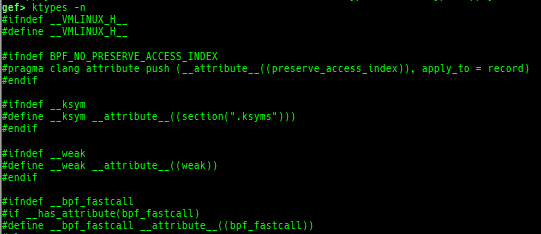
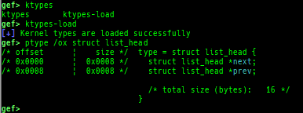
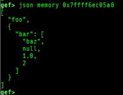

## Image


## Table of Contents
- [What Is This?](#what-is-this)
- [Setup](#setup)
    - [Supported Environment](#supported-environment)
    - [Install](#install)
    - [Upgrade](#upgrade)
    - [Uninstall](#uninstall)
    - [Dependencies](#dependencies)
- [Added / Improved Features](#added--improved-features)
    - [Supported Modes](#supported-modes)
    - [Qemu-system Cooperation](#qemu-system-cooperation)
    - [Qemu-user Cooperation](#qemu-user-cooperation)
    - [Heap Dump Features](#heap-dump-features)
    - [Improved Features](#improved-features)
    - [Added Features](#added-features)
    - [Other](#other)
- [FAQ](#faq)

## What Is This?
This is a fork of [GEF](https://github.com/hugsy/gef) that includes three major improvements:
1. Adds heuristic commands for kernel debugging __without requiring a symbolized `vmlinux`__ (for `qemu-system`, supports Linux kernel 3.x-6.17.x).
2. Expands support to [many architectures](docs/QEMU-USER-SUPPORTED-ARCH.md) (for `qemu-user`).
3. Provides heap dump commands for multiple memory allocators.

Numerous other commands have been added and enhanced. Enjoy!

## Setup

### Supported Environment
- Verified on Ubuntu 24.04 and 25.04.
- Expected to work on Ubuntu 22.04-23.10.
- Might work on Ubuntu 20.04-21.10, though not recommended.

### Install
- Run the following command (**NEW**: this is the `uv`-based installer).
    ```bash
    wget -q https://raw.githubusercontent.com/bata24/gef/dev/install-uv.sh -O- | sudo sh
    ```
- Notes
    - To simplify installation, `gef.py` is always installed to `/root/.gef/gef.py`
    - The required Python packages are in `/root/.gef/.venv-gef`.
    - GEF's directory (`/root/.gef`) is also registered in `/root/.gdbinit`.
    - For more installation options (no `venv`, minimal install, and for non-`root` user), see [docs/FAQ.md](docs/FAQ.md).

### Upgrade
```bash
python3 /root/.gef/gef.py --upgrade
```

- Note
    - If you get errors after upgrading, it may be due to old config. Try renaming `/root/.gef.rc`.

### Uninstall
```bash
rm -rf /root/.gef
rm -f /root/.gef.rc
rm -rf /tmp/gef
sed -i -e '/from gef import/d' /root/.gdbinit
```

### Dependencies
Please refer to [install.sh](install.sh) or [install-minimal.sh](install-minimal.sh) for installation requirements.

## Added / Improved Features

### Supported Modes
- Standard debugging
- Attaching to a running process
- Attaching to a process in an isolated namespace (e.g., attaching from outside a **Docker** container)
- Connecting to **Gdbserver**
- Connecting to the GDB stub of **Qemu-system**
- Connecting to the GDB stub of **Qemu-user**
- Connecting to the GDB stub of **Intel Pin**
- Connecting to the GDB stub of **Intel SDE**
- Connecting to the GDB stub of **Qiling framework**
- Connecting to the GDB stub of **KGDB** (requires GDB version 12 or later)
- Connecting to the GDB stub of **VMWare**
- Connecting to the GDB stub of **Wine**
- Debugging with **Record and replay** (`rr replay`)

For a comprehensive list and additional details, see [docs/SUPPORTED-MODE.md](docs/SUPPORTED-MODE.md).

### Qemu-system Cooperation
- `pagewalk`: dumps page tables.
    - x64 (Supported: 4-Level/5-Level Paging)
        - 
    - x86 (Supported: PAE/Non-PAE)
        - 
    - ARM64 (Supported: only Cortex-A, EL0-EL3, stage1-2)
        - ARM v8.7 base. 32bit mode is NOT supported.
        - 
        - Here is a sample of each level pagewalk from HITCON CTF 2018 `super_hexagon`.
        - 
        - Secure memory scanning is also supported, but you have to break in the secure world.
        - 
        - Pseudo memory map without detailed flags and permissions can be output even in the normal world (when OP-TEE).
        - 
    - ARM (Supported: only Cortex-A, LPAE/Non-LPAE, PL0/PL1)
        - ARM v7 base. PL2 is NOT supported.
        - 
        - Secure memory scanning is also supported, and you don't have to break in the secure world (unlike ARM64).
        - 
- `pagewalk-with-hints`: prints pagetables with description.
    - 
- `v2p`/`p2v`: displays the transformation between virtual addresses and physical addresses.
    - 
- `xp`: is a shortcut for physical memory dump.
    - 
- `qreg`: displays the register values from qemu-monitor (allows getting values like `$cs` even under qemu 2.x).
    - It is a shortcut for `monitor info registers`.
    - It also prints the details of each bit of the system register when x64/x86.
    - 
- `sysreg`: pretty prints system registers.
    - It shows `info registers` results, excluding general registers.
    - 
- `msr`: reads/writes MSR (Model Specific Registers) value by embedding/executing dynamic assembly.
    - Supported on x64 and x86.
    - 
- `cet`: displays Intel CET settings.
- `vbar`: displays ARM/ARM64 vector table.
    - 
- `kbase`: displays the kernel base address.
- `kversion`: displays the kernel version.
- `kcmdline`: displays the kernel cmdline used at boot time.
- `kcurrent`: displays current task address.
    - 
- `ksymaddr-remote`: displays kallsyms information from scanning kernel memory.
    - Supported kernel versions: 3.x to 6.17.x.
    - 
- `ksymaddr-remote-apply`/`vmlinux-to-elf-apply`: applies kallsyms information obtained by `ksymaddr-remote` or `vmlinux-to-elf` to gdb.
    - 
    - 
    - Once you get a symboled pseudo ELF file, you can reuse and apply it automatically even after rebooting qemu-system.
    - `vmlinux-to-elf-apply` and `ksymaddr-remote-apply` provide almost the same functionality.
        - `vmlinux-to-elf-apply`: Requires installation of external tools. Create `vmlinux` with symbols.
        - `ksymaddr-remote-apply`: Requires no external tools. Create a blank ELF with only embedded symbols.
- `ktypes`: displays kernel type information from scanning kernel memory.
    - 
- `ktypes-load`: loads kernel type information from scanning kernel memory.
    - 
- `slub-dump`: dumps slub free-list.
    - Supported on x64/x86/ARM64/ARM + `SLUB` + no-symbol + kASLR.
    - Supported regardless of whether `CONFIG_SLAB_FREELIST_HARDENED` is `y` or `n`.
    - Supported regardless of whether `CONFIG_SLAB_VIRTUAL` is `y` or `n` (x64-only).
    - It supports dumping partial pages (`-v`) and NUMA node pages (`-vv`).
    - Since `page_to_virt` is difficult to implement, it will heuristically determine the virtual address from the free-list.
    - 
- `slab-dump`: dumps slab free-list.
    - Supported on x64/x86/ARM64/ARM + `SLAB` + no-symbol + kASLR.
    - 
- `slob-dump`: dumps slob free-list.
    - Supported on x64/x86/ARM64/ARM + `SLOB` + no-symbol + kASLR.
    - 
- `slub-tiny-dump`: dumps slub-tiny free-list.
    - Supported on x64/x86/ARM64/ARM + `SLUB-TINY` + no-symbol + kASLR.
    - 
- `slab-contains`: resolves the slab cache (`kmem_cache`) that a certain address (object) belongs to (for `SLUB`/`SLUB-TINY`/`SLAB`).
    - 
    - For `SLUB`/`SLUB-TINY`, if all chunks belonging to a certain `page` are in use, they will not be displayed by `slub-dump`/`slub-tiny-dump` command.
    - Even with such an address (object), this command may be able to resolve `kmem_cache`.
- `buddy-dump`: dumps the zone of the page allocator (buddy allocator) free-list.
    - 
- `vmalloc-dump`: dumps `vmalloc` used-list and freed-list.
    - 
- `page`: displays the transformation between a `struct page` and its virtual/physical address.
    - 
    - There are shortcuts: `virt2page`, `page2virt`, `phys2page` and `page2phys`.
- `slab-virtual`: displays the transformation between slab-meta and its slab-data/`struct page` address (for `CONFIG_SLAB_VIRTUAL=y`).
    - 
- `kchecksec`: checks kernel security.
    - 
- `kmagic`: displays useful addresses in the kernel.
    - 
- `kconfig`: dumps the kernel config if available.
    - 
- `syscall-table-view`: displays the system call table.
    - 
    - It also dumps the ia32/x32 syscall table under x64.
    - It also dumps the compat syscall table under ARM64.
- `ksysctl`: dumps the sysctl parameters.
    - 
- `ktask`: displays each task's address.
    - 
    - It also displays the memory map of the userland process.
    - 
    - It also displays the register values saved on the kstack of the userland process.
    - 
    - It also displays the file descriptors of the userland process.
    - 
    - It also displays the signal handlers of the userland process.
    - 
    - It also displays the namespaces of the userland process.
    - 
    - It also displays the seccomp-filter.
    - 
- `kmod`: displays each module's address.
    - 
    - It also displays the symbols of each module.
    - 
- `kload`: loads `vmlinux` without a load address.
    - It is useful if you have a `vmlinux` with `debuginfo` at hand.
- `kmod-load`: loads the kernel module without a load address.
    - It is useful if you have a kernel module with `debuginfo` at hand.
- `kops`: displays each operation's member.
    - 
- `kcdev`: displays information for each character device.
    - 
- `kbdev`: displays information for each block device.
    - If there are too many block devices, detection will not be successful.
    - This is because block devices are not managed in one place, so I use the list of `bdev_cache` obtained from the slub-dump results.
    - 
- `kfilesystems`: dumps supported file systems.
    - 
- `kclock-source`: dumps the clocksource list.
    - 
- `kdmesg`: dumps the ring buffer of the dmesg area.
    - 
- `kpipe`: displays information for each pipe.
    - 
- `kbpf`: dumps the BPF information.
    - 
- `ktimer`: dumps the timer.
    - 
- `kpcidev`: dumps the PCI devices.
    - 
- `kipcs`: dumps IPCs information (System V semaphore, message queue and shared memory).
    - 
- `kdevio`: dumps I/O-port and I/O-memory information.
    - 
- `kdmabuf`: dumps DMA-BUF information.
    - 
- `kirq`: dumps irq information.
    - 
- `knetdev`: displays net devices.
    - 
- `ksearch-code-ptr`: searches for the code pointer in kernel data area.
    - 
- `thunk-tracer`: collects and displays the thunk function addresses that are called automatically (only x64/x86).
    - If this address comes from RW area, this is useful for getting RIP.
    - 
- `usermodehelper-tracer`: collects and displays the information that is executed by `call_usermodehelper_setup`.
    - 
- `kmalloc-tracer`: collects and displays information when `kmalloc`/`kfree`.
    - 
- `kmalloc-allocated-by`: calls a predefined set of system calls and prints structures allocated by `kmalloc` or freed by `kfree`.
    - 
- `ktrace`: traces kernel functions and arguments.
    - 
- `xsm`: dumps secure memory when gdb is in normal world.
    - Supported on ARM64 and ARM.
    - 
- `wsm`: writes the value to secure memory when gdb is in normal world.
    - Supported on ARM64 and ARM.
    - 
- `bsm`: sets the breakpoint to secure memory when gdb is in normal world.
    - Supported on ARM64 and ARM.
    - 
- `optee-break-ta`: sets the breakpoint to the offset of OPTEE-Trusted-App when gdb is in normal world.
    - Supported on ARM64 and ARM.
    - 
- `optee-smc-service-dump`: dumps OPTEE SMC services.
    - Supported on ARM64.
    - 
- `optee-ta-dump`: dumps the information of OPTEE-Trusted-Apps from the memory or specified host directory.
    - Supported on ARM64 and ARM.
    - 
- `optee-shm-list`: shows the information of dynamic shared-memory buffers.
    - Supported on ARM64 and ARM.
    - 
- `pac-keys`: pretty prints ARM64 PAC keys.
    - Supported on ARM64.
    - 
- `uefi-ovmf-info`: dumps addresses of some important structures in each boot phase of UEFI when OVMF is used.
    - Supported on x64.
    - 
- `qemu-device-info`: dumps device information for qemu-escape.

### Qemu-user Cooperation
- `si`/`ni`: are wrappers for native `si`/`ni` if OpenRISC 1000 or CRIS.
    - On OpenRISC 1000 architecture, branch operations don't work well, so GEF uses breakpoints to simulate.
    - On CRIS architecture, `stepi`/`nexti` commands don't work well, so GEF uses breakpoints to simulate.
    - If you want to use native `si`/`ni`, use the full form `stepi`/`nexti`.
- `c`: is the wrapper for native `c` if gdb is connected to `qemu-user` or `Intel Pin`.
    - When connecting to gdb stub of `qemu-user` or `Intel Pin`, gdb does not trap `SIGINT` during `continue`.
    - If you want to trap, you need to issue `SIGTRAP` on the `qemu-user` or `pin` side, but switching screens is annoying.
    - This command realizes a pseudo `SIGTRAP` trap by trapping `SIGINT` on the Python side and throwing `SIGTRAP` back to `qemu-user` or `Intel Pin`.
    - It works only for local `qemu-user` or `Intel Pin`.
    - If you want to use native `c`, use the full form `continue`.

### Heap Dump Features
- Glibc heap commands has been improved.
    - It changes the color and prints a symbol if it exists.
        - 
    - They print bins information if the chunk is in free-list.
        - 
    - Thread arena is supported for all `heap` commands.
        - Use `-a` option.
    - It supports some new sub-commands.
        - `heap arenas`
            - 
        - `heap top`
            - 
        - `heap bins-simple`: displays the heap like pwndbg style.
            - 
        - `heap parse`: displays the heap like as Pwngdb/angelheap style.
            - 
        - `heap try-malloc`
            - 
        - `heap try-free`
            - 
            - You can also execute any command on the memory status after emulation is completed.
                - 
        - `heap try-realloc`
        - `heap try-calloc`
        - `heap tcache-index-helper`
            - 
        - `heap find-fake-fast`: searches for a memory with a size-like value that can be linked to the fastbin free-list.
            - 
        - `heap extract-heap-addr`: analyzes tcache-protected-fd introduced from glibc-2.32.
            - 
        - `heap calc-protected-fd`: calculates a valid value as protected fd.
            - 
        - `heap visual-heap`: is colorized heap viewer.
            - 
        - `heap tracer`: has been integrated from `heap-analysis-helper` and rewritten.
            - 
- uClibc heap commands are added.
    - `uclibc-ng-heap-dump`: dumps uClibc-ng heap chunks.
        - Supported on x64 and x86, based on uClibc-ng v1.0.42 malloc-standard.
        - 
        - How to test (x64):
            - Download and extract `x86-64--uclibc--stable-2024.05-1.tar.bz2` from https://toolchains.bootlin.com/
            - Add `/PATH/TO/x86_64-buildroot-linux-uclibc/bin` to `$PATH`, then build as `x86_64-linux-gcc test.c`.
            - Fix interpreter by `patchelf --set-interpreter /PATH/TO/x86_64-buildroot-linux-uclibc/sysroot/lib/ld64-uClibc.so.0 a.out`.
    - `uclibc-ng-visual-heap`: is colorized heap viewer for uClibc-ng.
        - 
- `partition-alloc-dump`: dumps Partition-Alloc free-list for chromium.
    - 
    - This command is reserved for the implementation of the latest version of Chromium.
        - Currently tested: v140.x / [1493770](https://commondatastorage.googleapis.com/chromium-browser-snapshots/index.html?prefix=Linux_x64/1493770/) / 4175e5c939a0f18e5176d49a79f36b9a81ea77fd
    - Supported on x64 and ARM64 (maybe it works on x86/ARM too, but not tested).
    - It will try heuristic search if the binary has no symbol.
    - How to test:
        - See [dev/partition-alloc-dump/downloader.py](dev/partition-alloc-dump/downloader.py).
- `tcmalloc-dump`: dumps TCMalloc (`gperftools-2.16-1` or named `libgoogle-perftools{4,-dev}`) free-list (only x64).
    - 
    - How to test:
        - Execute as `LD_PRELOAD=/usr/lib/x86_64-linux-gnu/libtcmalloc.so ./a.out`.
- `musl-heap-dump`: dumps Musl-Libc v1.2.5 heap chunks (only x64/x86).
    - 
    - How to test:
        - Get and extract the latest source from https://musl.libc.org/
        - Build with `./configure && make install`.
        - Build as `/usr/local/musl/bin/musl-gcc test.c`.
- `go-heap-dump`: dumps Go Language v1.22.2 mheap (only x64).
    - 
- `tlsf-heap-dump`: dumps TLSF (Two-Level Segregated Fit) v2.4.6 free-list (only x64).
    - 
    - How to test (x64):
        - Get and extract the latest source from http://www.gii.upv.es/tlsf/
        - Build with `cd TLSF-2.4.6/src && make && cd ../examples && make` then use `test1` etc.
- `hoard-heap-dump`: dumps Hoard v3.13 free-list (only x64).
    - 
    - How to test (x64):
        - Get and extract the latest source from https://github.com/emeryberger/Hoard
        - Build with `cd Hoard/src && make`.
        - Execute as `LD_PRELOAD=/PATH/TO/libhoard.so ./a.out`.
- `mimalloc-heap-dump`: dumps mimalloc free-list (only x64).
    - 
    - How to test (x64):
        - Get and extract the latest source from https://github.com/microsoft/mimalloc
        - Build with `mkdir build && cd build && cmake -DCMAKE_BUILD_TYPE=Debug .. && make`.
        - Execute as `LD_PRELOAD=/PATH/TO/libmimalloc.so ./a.out`.
- `scalloc-heap-dump`: dumps scalloc free-list (only x64).
    - 
    - How to test (x64):
        - Get and extract the latest source from https://github.com/cksystemsgroup/scalloc
        - Fix the bug with `sed -i -e 's/\(strncat(.*\), 1);/\1, 2);/' src/log.h`.
        - Build with `gyp --depth . scalloc.gyp && make`.
        - Enable overcommit with `echo 1 > /proc/sys/vm/overcommit_memory`.
        - Execute as `LD_PRELOAD=/PATH/TO/libscalloc.so ./a.out`.
- `snmalloc-heap-dump`: dumps snmalloc free-list (only x64).
    * 
    * How to test (x64):
        - Get and extract the latest source from https://github.com/microsoft/snmalloc
        - Build with `mkdir build && cd build && cmake -G Ninja .. -DCMAKE_BUILD_TYPE=Debug && ninja`.
        - Execute as `LD_PRELOAD=/PATH/TO/libsnmallocshim.so ./a.out`.
- `optee-bget-dump`: dumps bget allocator of OPTEE-Trusted-App.
    - 
- `v8`: displays v8 tagged object.
    - 
    - It also loads more commands from latest gdbinit for v8.
    - 
- `cage`: displays v8 (especially `d8`) ubercage.
    - 
- `v8-list-maps`: lists v8 (especially d8) built-in maps.
    - 
- `v8-dump-space`: dumps v8 (especially d8) heap objects in each space.
    - 

### Improved Features
- `vmmap`
    - It displays the memory map information even when connecting to gdb stub of `qemu-user`.
        - 
    - It also supports `Intel Pin`.
        - 
    - It also supports `Intel SDE`.
        - 
    - It is redirected to `pagewalk` when connecting to gdb stub of `qemu-system`.
    - It supports detection and coloring of `Writable`, `ReadOnly`, `None` and `RWX` regions.
    - It shows the area each register points to.
- `registers`
    - It also shows raw values of the flag register, the current ring, the exception level, the secure state, etc.
        - 
        - 
        - 
- `context`
    - It supports automatic display of system call arguments when calling a system call.
        - 
    - It supports new commands:
        - `context on`
        - `context off`
    - It supports automatic display of address and value when accessing memory.
        - 
    - It supports smart symbol printing for C++ function.
        - ex: `std::map<int, std::map<int, int>>` will be replaced by `std::map<...>`.
        - 
        - command: `gef config context.smart_cpp_function_name true` or `smart-cpp-function-name` (later is used to toggle).
- `telescope`
    - It displays ordinal numbers as well as offsets.
    - It displays if there are canaries and return addresses in the target area.
        - 
    - It supports blacklist address features (to avoid dying when touching the address mapped to the serial device).
    - It also shows the symbol if available.
    - It supports some new options:
        - `--is-addr`
        - `--is-not-addr`
        - `--is-zero`
        - `--is-not-zero`
        - `--tag`
        - `--uniq`
        - `--interval`
        - `--depth`
        - `--phys`
        - `--list-head`
        - `--slab-contains`
        - `--slab-contains-unaligned`
- `proc-info`
    - It displays some additional information.
        - 
- `elf-info`
    - It displays Program Header and Section Header.
    - It supports parsing from memory.
    - It supports parsing remote binary (if download feature is available).
        - 
- `xinfo`
    - It shows more information.
        - 
    - It also supports kernel debugging.
- `checksec`
    - It shows additional information.
        - Static or Dynamic or Static-PIE
        - Stripped or not
        - Debuginfo or not
        - Intel CET IBT/SHSTK
        - ARMv8 PAC, ARMv8 MTE
        - RPATH, RUNPATH
        - Clang CFI/SafeStack
        - System-ASLR, GDB ASLR setting
    - It supports parsing remote binary (if download feature is available).
    - 
- `got`
    - It displays not only GOT address but also PLT address.
        - 
    - It scans `.plt.sec` section if Intel CET is enabled.
    - It can also display the GOT of the library.
        - 
    - It can also display `type`, `offset`, `reloc_arg`, `section` and `permission`.
        - 
- `canary`
    - It displays all canary positions in memory.
        - 
- `edit-flags`
    - It displays the meaning of each bit if `-v` option is provided.
        - 
        - 
        - 
- `unicorn-emulate`
    - It reads and writes correctly to the address pointed to by `$fs`/`$gs`.
    - It supports a new mode to stop after executing N instructions (`-g`).
    - It shows changed memories.
        - 
    - It supports replacing the GOT of string functions using avx2 or NEON, which unicorn does not support, with slower original functions.
- `ropper`
    - It does not reset autocomplete settings after calling imported `ropper`.
- `hexdump`
    - It supports physical memory if under qemu-system.
    - It will retry with adjusting read size if reading memory fails.
    - By default, the same line is omitted.
    - 
- `patch`
    - It supports physical memory if under qemu-system.
    - Added some new modes:
        - `patch hex`
        - `patch pattern`
        - `patch nop`
        - `patch inf`
        - `patch trap`
        - `patch ret`
        - `patch syscall`
        - `patch history`
        - `patch revert`
        - `patch range-replace`
    - `nop` command has been integrated into `patch` as sub-command.
    - 
- `search-pattern`
    - It is supported under qemu-system (in short, it works without `/proc/self/maps`)
    - It supports some new options:
        - `--hex`
        - `--hex-regex`
        - `--aligned`
        - `--perm`
        - `--interval`
        - `--limit`
        - `--max-region-size`
        - `--phys`
    - It also searches for UTF-16 string if target string is ASCII.
    - 
- `mprotect`
    - Rewritten to use `call-syscall`.
- `hijack-fd`
    - It supports more architectures.
    - 
- `format-string-helper`
    - It supports more `printf`-like functions.
- `theme`
    - Supports many colors.
    - 
    - 
- `reset-cache`
    - It has been integrated into `gef` as sub-command.
    - The cache structure within GEF has changed significantly. This command corresponds to them.
- `tmux-setup`
    - It has been integrated into `gef` as sub-command.
    - `screen` is no longer supported.
    - `tmux` settings are predefined and cannot be customized.
    - If you want to customize it, edit [dev/tmux/tmux_setup.py](dev/tmux/tmux_setup.py) and run `source /path/to/tmux_setup.py`.

### Added Features
- `pid`/`tid`: prints pid and tid.
- `filename`: prints filename.
- `fds`: shows opened file descriptors.
- `auxv`: pretty prints ELF auxiliary vector.
    - Supported also under `qemu-user`.
    - 
- `argv`/`envp`: pretty prints argv and envp.
    - 
- `dumpargs`: dumps arguments of current function.
    - 
- `vdso`: disassembles the text area of vdso smartly.
    - 
- `vvar`: dumps the area of vvar.
    - This area is mapped to userland, but cannot be accessed from gdb.
    - Therefore, it executes the assembly code and retrieves the contents.
    - 
- `gdtinfo`: pretty prints GDT entries. If userland, show sample entries.
    - 
- `idtinfo`: pretty prints IDT entries. If userland, show sample entries.
    - 
- `tls`: pretty prints TLS area. Requires glibc.
    - 
- `fsbase`/`gsbase`: pretty prints `$fs_base`, `$gs_base`.
    - 
- `libc`/`ld`/`heapbase`/`codebase`: displays each of the base address.
    - 
- `got-all`: shows got entries for all libraries.
- `break-rva`: sets a breakpoint at relative offset from codebase.
    - 
- `command-break`: sets a breakpoint which executes user defined command if hit.
    - 
- `main-break`: sets a breakpoint at `main` with or without symbols, then continue.
    - This is useful when you just want to run to `main` using `qemu-user` or `pin`, or debugging no-symbol ELF.
- `load-break`: breaks if something is loaded.
- `regdump-break`: sets a breakpoint which dumps specified registers if hit.
- `multi-break`: sets multiple breakpoints easily.
- `break-if-taken`/`break-if-not-taken`: sets a breakpoint which breaks if branch is taken (or not taken).
- `distance`: calculates the offset from its base address.
    - 
- `fpu`/`mmx`/`sse`/`avx`/`avx512`: pretty prints FPU/MMX/SSE/AVX/AVX512 registers.
    - 
- `xmmset`: sets the value to xmm/ymm/zmm register simply.
    - 
- `mmxset`: sets the value to mm register simply.
    - 
- `exec-until`: executes until specified operation.
    - Supports the following patterns:
        - call
        - jmp
        - syscall
        - ret
        - indirect-branch (only x64/x86)
        - all-branch (call || jmp || ret)
        - memory-access (detect just `[...]`)
        - specified-keyword-regex
        - specified-condition (expressions using register or memory values)
        - user-code
        - libc-code
        - secure-world
    - 
- `call-trace`: traces call, ret, and syscall instructions.
    - 
- `xuntil`: executes until specified address.
    - It is slightly easier to use than the original until command.
- `add-symbol-temporary`: adds symbol information from command-line.
    - 
- `errno`: displays errno list or specified errno.
    - 
- `u2d`: shows cast/convert u64 <-> double/float.
    - 
- `unsigned`: shows unsigned value.
    - 
- `convert`: shows various conversion.
    - 
- `addressify`: converts reverse-order hex values to address.
    - 
- `walk-link-list`: walks the link list.
    - 
- `hexdump-flexible`: displays the hexdump with user defined format.
    - 
- `hash`: calculates various hashes.
    - 
- `crc`: calculates various CRCs.
    - 
- `json`: pretty prints json.
    - 
- `base-n-decode`/`base-n-encode`: decodes/encodes various baseN.
    - 
- `morse-decode`/`morse-encode`: decodes/encodes morse code.
    - 
- `saveo`/`diffo`: saves and diffs the command outputs.
    - 
- `memcmp`: compares the contents of the address A and B, whether virtual or physical.
    - 
- `memset`: sets the value to the memory range, whether virtual or physical.
- `memcpy`: copies the contents from the address A to B, whether virtual or physical.
- `memswap`: swaps the contents of the address A and B, whether virtual or physical.
- `meminsert`: inserts the contents of the address A to B, whether virtual or physical.
    - 
- `strlen`: detects the length of the string.
    - 
- `is-mem-zero`: checks the contents of address range are all 0x00 or 0xff.
    - 
- `seq-length`: detects consecutive length of the same sequence.
    - 
- `strings`: searches for ASCII string from specific location.
    - 
- `xs`: dumps string like `x/s` command, but with hex-string style.
    - 
- `xc`: dumps address like `x/x` command, but with coloring at some intervals.
    - 
- `ii`: is a shortcut for `x/50i $pc` with opcode bytes.
    - It prints the value if it is memory access operation.
    - 
- `extra`: manages user specified command to execute when each step.
- `comment`: manages user specified temporary comment.
- `seccomp`: invokes `seccomp-tools`.
- `onegadget`: invokes `one_gadget`.
    - 
- `rp`: invokes `rp++` with commonly used options.
- `call-syscall`: calls system call with specified values.
    - 
- `mmap`: allocates a new memory by `call-syscall`.
- `killthreads`: kills specific or all threads (for `pthread`).
- `constgrep`: invokes `grep` under `/usr/include/`.
    - 
- `proc-dump`: dumps each file under `/proc/PID/`.
    - 
- `up`/`down`: are wrappers for native `up`/`down`.
    - It shows also backtrace.
- `time`: measures the time of the GDB command.
    - 
- `multi-line`: executes multiple GDB commands in sequence.
    - 
- `cpuid`: shows the result of cpuid(eax=0,1,2...).
    - 
- `read-system-register`: reads system register for old `qemu-system-arm`.
    - 
- `read-control-register`: reads control register for kgdb.
- `capability`: shows the capabilities of the debugging process.
    - 
- `dasm`: disassembles the code by capstone.
    - 
- `asm-list`: lists instructions. (only x64/x86)
    - 
    - This command uses x86data.js from https://github.com/asmjit/asmdb
- `syscall-search`: searches for system call by regex.
    - 
- `dwarf-exception-handler`: dumps the DWARF exception handler information.
    - 
- `magic`: displays useful addresses in glibc etc.
    - 
- `dynamic`: dumps the `_DYNAMIC` area.
    - 
- `link-map`: dumps useful members of `link_map` with iterating.
    - 
- `dtor-dump`: dumps some destructor functions list.
    - 
- `ptr-mangle`: shows the mangled value that will be mangled by `PTR_MANGLE`.
- `ptr-demangle`: shows the demangled value of the value mangled by `PTR_MANGLE`.
    - 
- `search-mangled-ptr`: searches for the mangled value from RW memory.
    - 
- `follow`: changes `follow-fork-mode` setting.
    - 
- `smart-cpp-function-name`: toggles `context.smart_cpp_function_name` setting.
- `ret2dl-hint`: shows the structure used by return-to-dl-resolve as hint.
    - 
- `srop-hint`: shows the code for sigreturn-oriented-programming as hint.
    - 
- `sigreturn`: displays stack values for sigreturn syscall.
    - 
- `smart-memory-dump`: dumps all regions of the memory to each file.
    - 
- `load-file`: loads the file into memory.
- `load-file-mmap`: loads the file into memory that allocated by `mmap`.
- `search-cfi-gadgets`: searches for CFI-valid (for CET IBT) and controllable generally gadgets in the executable area.
    - 
- `symbols`: lists all symbols with coloring.
    - 
- `types`: lists all types with compaction.
    - 
- `dt`: makes it easier to use `ptype /ox TYPE` and `p ((TYPE*) ADDRESS)[0]`.
    - 
    - This command is designed for several purposes.
        1. When displaying very large struct, you may want to go through a pager because the results will not fit on one screen.
           However, using a pager, the color information disappears. This command calls the pager with preserving colors.
        2. When `ptype /ox TYPE`, interpreting member type recursively often result is too long and difficult to read.
           This command keeps result compact by displaying only top-level members.
        3. When `p ((TYPE*) ADDRESS)[0]` for large struct, the setting of `max-value-size` is too small to display.
           This command adjusts it automatically.
        4. When debugging a binary written in the Golang, the offset information of the type is not displayed.
           This command also displays the offset.
        5. When debugging a binary written in the Golang, the `p ((TYPE*) ADDRESS)[0]` command will be broken.
           This is because the Golang helper script is automatically loaded and overwrites the behavior of `p` command.
           This command creates the display results on the Python side, so we can display it without any problems.
- `mte-tags`: displays the MTE tags for the specified address.
    - Supported on ARM64.
    - 
- `iouring-dump`: dumps the area of iouring (only x64).
    - This area is mapped to userland, but cannot be accessed from gdb.
    - Therefore, it executes the assembly code and retrieves the contents.
    - 
- `gef version`: shows software versions that GEF uses.
    - 
- `gef status`: shows architecture information used in GEF.
    - 
- `gef reset-breakpoint`: shows and resets all breakpoints.
- `gef arch-list`: displays defined architecture information.
    - 
- `gef pyobj-list`: displays defined global Python objects.
    - 
- `gef avail-comm-list`: displays a list of commands which are available or not for the current architecture and gdb execution mode.
    - 
- `gef set-arch`: sets a specific architecture to GEF.
- `gef check-update`: checks for GEF updates.
- `binwalk-memory`: scans memory by `binwalk`.
    - 
- `filetype-memory`: scans memory by `file` and `magika`.
    - 
- `sixel-memory`: shows image to terminal by `imagemagick`.
    - 
    - If you have `pillow` and `pyzbar` installed, a barcode detection option is also available.
- `stdio-dump`: dumps members of stdin/stdout/stderr.
    - 
- `peek-pageframe`: reads page frame data.
    - 
- `peek-pageflags`: reads page flags of a page frame.
    - 
- `angr`: finds simple constraints by `angr`.
    - 
- `history`: shows gdb command history easily.
    - 
- `crc32rev`: performs CRC32 reverse calculation limited to ASCII character range.
    - 
- `vdump`: visualizes memory data like an image.
    - 
- `freq-analysis`: visualizes the frequency of occurrence of each byte.
- `qemu-system-memory-region-dump`: dumps memory regions for `qemu-system`.
    - 
- `find-syscall`: searches the syscall gadget.
    - 
- `fpchain`: dups chains from `__IO_list_all`.
    - 

### Other
- The category is introduced in `gef help`.
    - 
- Combined into one file (from `gef-extras`). The following are moved from `gef-extras`.
    - `current-stack-frame`, `xref-telescope`, `bytearray`, and `bincompare`.
    - This is because a single file is more attractive for me than ease of maintenance.
- The system-call table used by `syscall-args` is moved from `gef-extras`.
    - It was updated up to Linux kernel 6.17 for each architecture.
- Removed some features that I don't use.
    - `$`
    - `ida-interact`
    - `gef-remote`
    - `pie`
    - `pcustom`
    - `ksymaddr`
    - `trace-run`
    - `shellcode`
- Many bug fixes / formatting improvements / usability enhancements (made it easy for me to use).

## FAQ
- See [docs/FAQ.md](docs/FAQ.md).
